<div align="center">

# 曼波足球

### 足球赛前预测与比赛数据微信小程序

原生微信小程序 · CloudBase 云开发 · 赛事数据聚合 · 预测战绩追踪

[](#微信扫码体验)
[](docs/DEPLOYMENT.md)
[](miniprogram/)
[](#案例仓库说明)

[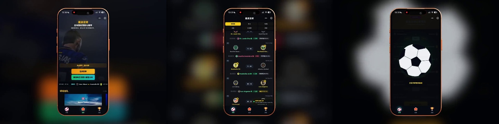](docs/media/demo.mp4)

**[▶ 查看 54 秒完整效果视频](docs/media/demo.mp4)**

</div>

## 项目介绍

曼波足球是一款围绕足球赛程、赛前概率和历史预测战绩构建的微信小程序。产品将比赛筛选、胜平负概率、实时赛果、模型趋势和战绩复盘放在同一套移动端体验中，方便用户快速了解焦点赛事。

本仓库用于个人作品集展示。仓库提供可直接导入微信开发者工具的脱敏案例代码，页面默认使用 Mock 数据，不包含生产 AppID、CloudBase 环境 ID、第三方 API Key、线上用户数据或真实采集逻辑。

## 微信扫码体验

<table>
  <tr>
    <td width="220" align="center">
      <br>
      <strong>微信扫码进入小程序</strong>
    </td>
    <td>
      <strong>线上版本主要体验</strong><br><br>
      • 按赛事和时间查看足球比赛<br>
      • 查看主胜、平局、客胜预测概率<br>
      • 跟踪即时比分和比赛状态<br>
      • 按联赛、模型与时间复盘预测战绩<br>
      • 查看公开数据趋势与比分分布
    </td>
  </tr>
</table>

> 截图和视频来自线上版本，界面中的比赛、比分和概率会随赛事更新。仓库内代码使用独立 Mock 数据。

## 产品截图

### 赛事发现与赛前预测

| 产品首页 | 球场巡礼 | 预测列表 |
| --- | --- | --- |
|  | 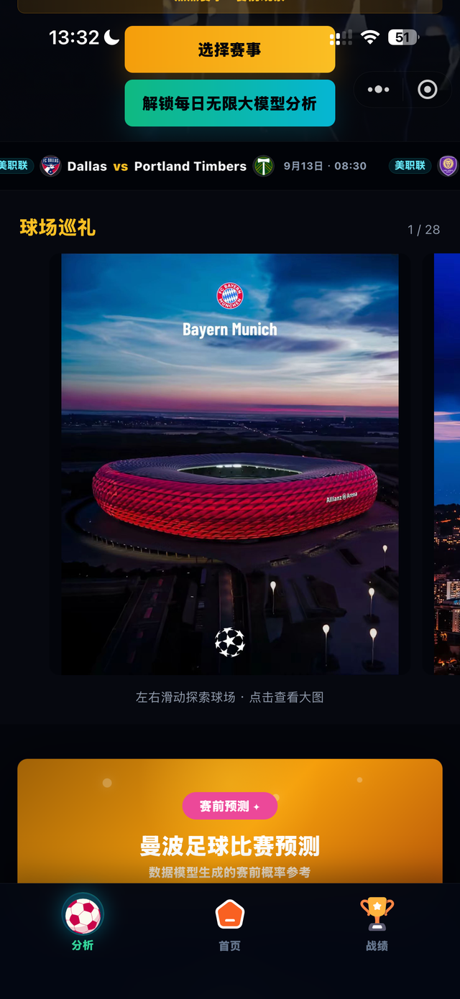 | 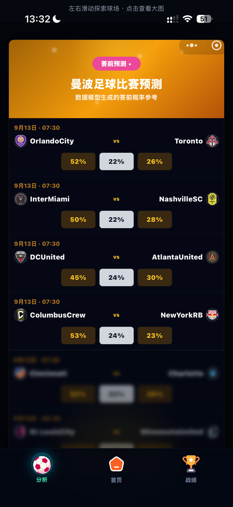 |

### 比赛详情与赛程

| 比赛详情 | 即时赛果 | 世界杯赛程 |
| --- | --- | --- |
| 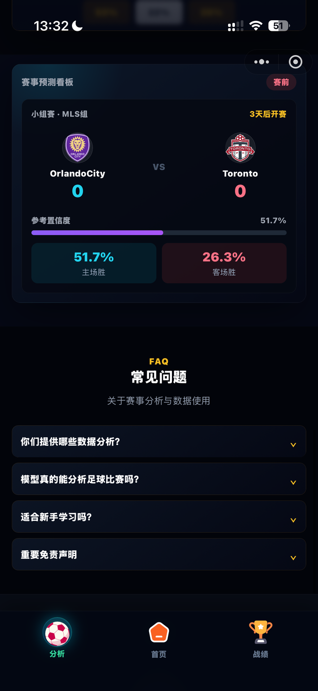 | 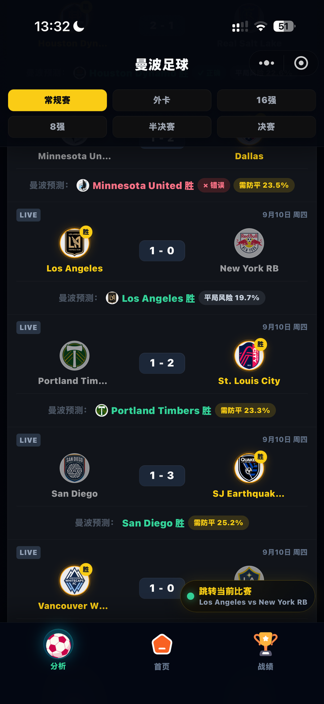 | 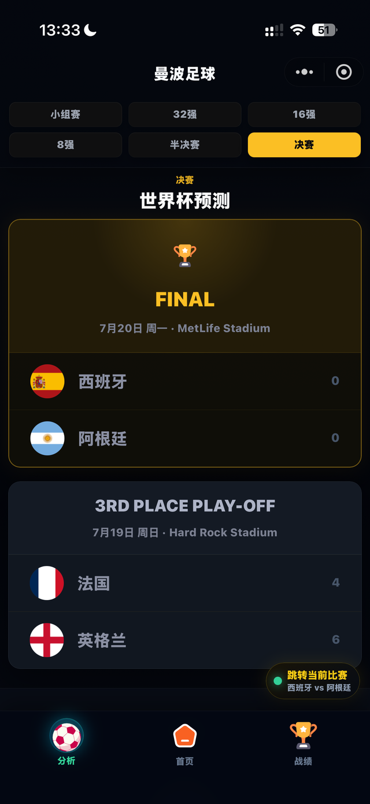 |

### 战绩与公开数据

| 战绩总览 | 分类战绩 | 数据趋势 | 比分分布 |
| --- | --- | --- | --- |
| 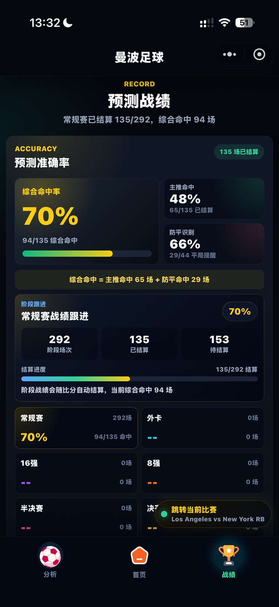 | 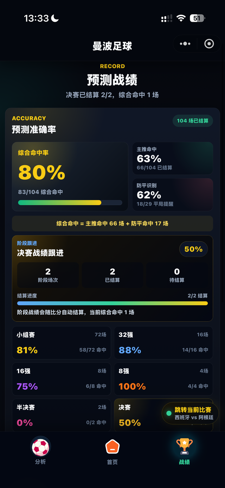 | 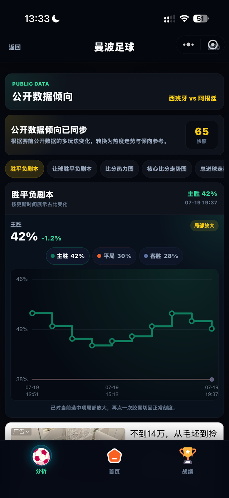 | 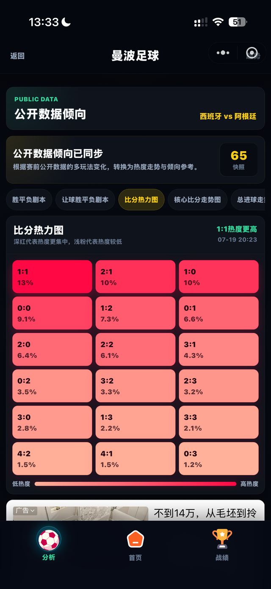 |

## 案例仓库说明

| 内容 | 说明 |
| --- | --- |
| 小程序端 | 原生 WXML、WXSS 与 JavaScript 页面 |
| 公共组件 | 可复用的比赛卡片组件 |
| 数据示例 | 可离线运行的赛事、概率与战绩 Mock 数据 |
| 云函数 | 使用 `cloud.DYNAMIC_CURRENT_ENV` 的脱敏查询示例 |
| 环境配置 | 占位 AppID、环境 ID和存储地址模板 |
| 项目文档 | 本地预览、CloudBase 部署说明与安全边界 |

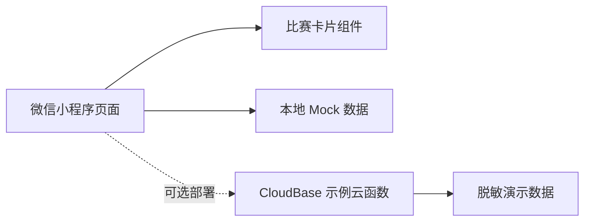

## 本地运行

1. 安装微信开发者工具。
2. 导入本仓库根目录。
3. 使用测试号，或将 `project.config.json` 中的 `touristappid` 换成自己的 AppID。
4. 点击“编译”，使用内置 Mock 数据浏览首页、比赛预测和历史战绩页面。

仓库默认不连接云端。如需体验示例云函数，将 `env.example.js` 复制为 `env.js`，填写自己的测试环境并部署 `cloudfunctions/getDemoData`。完整步骤见 [部署说明](docs/DEPLOYMENT.md)。

## 目录结构

```text
cloudfunctions/getDemoData/   脱敏云函数示例
docs/assets/                  小程序码与视频封面
docs/media/                   压缩后的效果视频
docs/screenshots/             线上版本实机截图
miniprogram/components/       公共组件
miniprogram/data/mock.js      本地 Mock 数据
miniprogram/pages/            首页、预测、战绩
env.example.js                占位环境配置
project.config.json           占位 AppID
```

## 安全边界

- 案例源码中的球队、比分和概率均为 Mock 数据。
- 生产密钥、用户数据、固定云环境和采集实现未进入本仓库。
- `env.js`、私有项目配置和本地依赖已加入 `.gitignore`。
- 截图、视频和小程序码仅用于展示本人已上线项目的实际效果。

## License

源码用于作品集展示和代码评审。版权及使用条件见 [LICENSE](LICENSE)。
