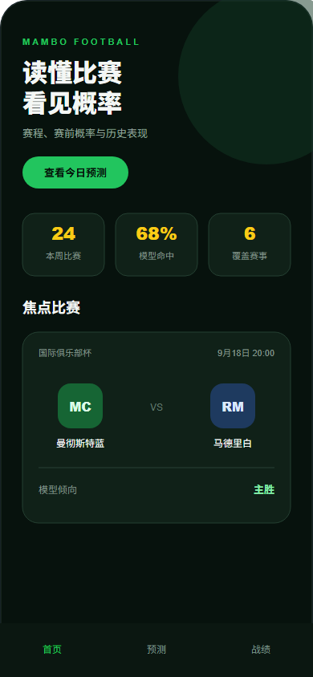
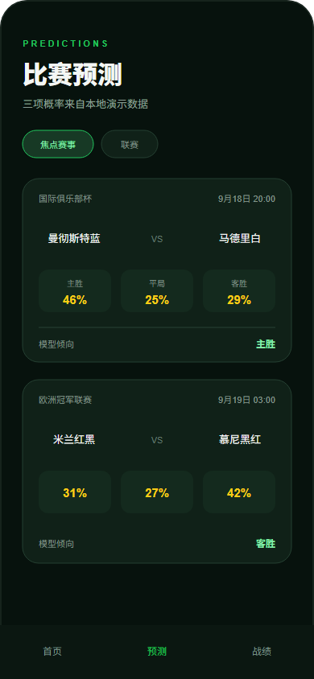
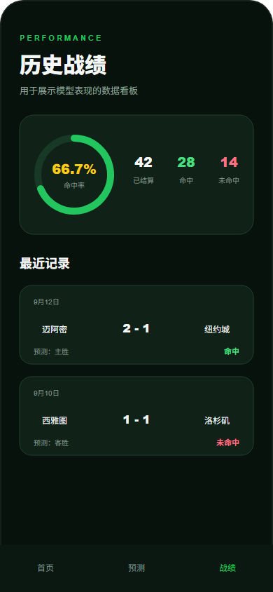

# 曼波足球 · 微信小程序案例

一个用于个人作品集展示的原生微信小程序案例，包含足球赛程、赛前概率和历史战绩界面。

> 本仓库是脱敏演示版本。页面使用 Mock 数据，不包含生产 AppID、CloudBase 环境 ID、第三方 API Key、线上用户数据或真实采集逻辑。

## 页面预览

| 首页 | 比赛预测 | 历史战绩 |
| --- | --- | --- |
|  |  |  |

## 功能

- 原生微信小程序页面、组件和 WXSS 样式
- 首页指标、焦点比赛和赛事状态
- 主胜、平局、客胜三项概率展示
- 历史命中率及最近战绩
- 可复用的比赛卡片组件
- 本地 Mock 数据，可离线预览
- 脱敏 CloudBase 云函数示例
- AppID、环境 ID和存储地址配置模板

## 快速运行

1. 安装微信开发者工具。
2. 导入本仓库根目录。
3. 使用测试号，或者将 `project.config.json` 中的 `touristappid` 换成自己的 AppID。
4. 点击“编译”，即可使用内置 Mock 数据预览三个页面。

## 可选 CloudBase 示例

仓库默认不连接云端。需要体验云函数时：

1. 将 `env.example.js` 复制为 `env.js` 并填写自己的测试环境。
2. 在微信开发者工具中选择自己的云开发环境。
3. 部署 `cloudfunctions/getDemoData`。

完整步骤见 [部署说明](docs/DEPLOYMENT.md)。

## 目录结构

```text
cloudfunctions/
  getDemoData/             脱敏云函数示例
docs/
  screenshots/             页面预览
  DEPLOYMENT.md            本地与 CloudBase 部署说明
miniprogram/
  components/match-card/   共用比赛卡片
  data/mock.js             本地 Mock 数据
  pages/                   首页、预测、战绩
env.example.js             占位环境配置
project.config.json        占位 AppID
```

## 安全说明

- 示例中的球队、比分和概率均为虚构数据。
- 不要向仓库提交真实密钥、用户数据或生产环境配置。
- `env.js`、私有项目配置和本地依赖已加入 `.gitignore`。

## License

源码用于作品集展示和代码评审。版权及使用条件见 [LICENSE](LICENSE)。
